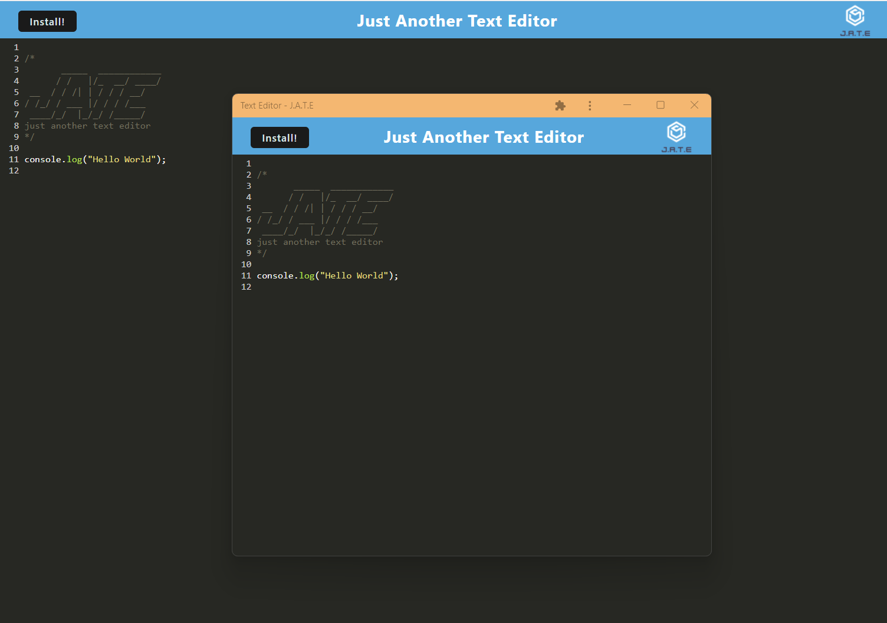

# PWA Text Editor

## Description
A text editor that runs in the browser and is an installable PWA app.

- Link to deployed app: https://alex-pwa-homework.herokuapp.com/

## Table of Contents

- [Installation](#installation)

- [Usage](#usage)

- [License](#license)

- [Contributing](#contributing)

- [Questions](#Questions)

## Installation

The application may be installed as a PWA using the install button on the page or clicking the install icon on the right side of the browser's search bar.

## Usage

The application can be installed as a PWA using the install button on the page or clicking the install icon on the right side of the browser's search bar. 

## License

 This application is covered under the [MIT License](LICENSE)

## Contributing

N/A

### Screenshots

